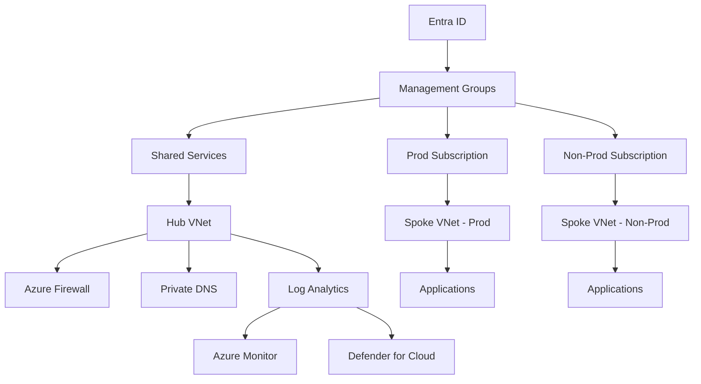

# Azure Landing Zone Architecture

## Overview

Designed and implemented a standardized **Azure Landing Zone** aligned with the **Microsoft Cloud Adoption Framework (CAF)** to enable secure, scalable, and consistent cloud adoption.

The objective was to create a secure Azure foundation that allows new workloads to be onboarded quickly while maintaining governance, compliance, and operational visibility.

---

## Business Challenge

The organization faced:

- Inconsistent subscription structures
- Manual resource provisioning
- Security gaps and misconfigurations
- No centralized logging or monitoring
- Lack of governance guardrails

Each new workload required re-designing identity, networking, and security patterns from scratch.

---

## Solution Architecture

The solution introduced a policy-driven, automated Azure Landing Zone including:

- Management Group hierarchy
- Environment-based subscriptions (Prod / Non-Prod / Shared)
- Hub-Spoke networking topology
- Centralized identity governance
- Infrastructure as Code deployments
- Security guardrails enforced by policy

---

## Architecture Diagram

---

## Key Architecture Components

### Governance

- Azure Management Groups
- Subscription segmentation
- Azure Policy initiatives
- RBAC and Privileged Identity Management

### Identity & Access

- Entra ID integration
- Conditional Access
- Least privilege model

### Networking

- Hub-Spoke topology
- Azure Firewall
- Private Endpoints
- NSG segmentation
- Private DNS zones

### Security

- Defender for Cloud baseline
- Secure defaults enforced via policy
- Key Vault integration
- Zero Trust network segmentation

### Observability

- Central Log Analytics workspace
- Azure Monitor
- Diagnostic settings enforced via policy
- Centralized alerting model

### Automation

- Terraform / Bicep modules
- Azure DevOps / GitHub Actions CI/CD
- Reusable deployment pipelines

---

## Measurable Outcomes

- Reduced workload onboarding time by **~40%**
- Enforced consistent governance across subscriptions
- Improved audit readiness and compliance visibility
- Reduced misconfiguration risks through automated guardrails
- Enabled scalable, repeatable cloud deployments

---

## My Role

- Designed end-to-end landing zone architecture
- Defined management group hierarchy
- Implemented governance and RBAC model
- Built Infrastructure as Code modules
- Established CI/CD automation pipelines
- Conducted architecture reviews and security validations
